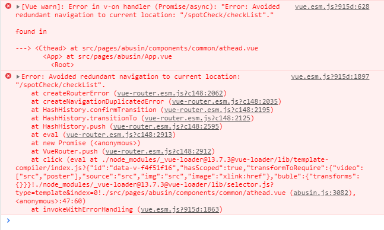

## 1.git pull 报错 fatal: refusing to merge unrelated histories

### 问题产生原因
> git merge command拒绝合并不是同一祖先的历史记录。报错出现的场景，通常是直接把本地项目上传到远程仓库。从远程直接克隆下来的项目不会存在这个问题

### 解决方法
```
$ git pull origin master –allow-unrelated-histories
```

<!--more-->

## 2.vue + elementui 报错 Avoided redundant navigation to current location...



### 问题产生原因
> 重复点击相同的tab栏菜单，会报错，但是不影响功能

### 解决方法
```
// 打开router目录下的index.js文件，复制下面代码，添加到最下方就可以了
const originalPush = VueRouter.prototype.push
  VueRouter.prototype.push = function push (location) {
  return originalPush.call(this, location).catch(err => err)
}
```
